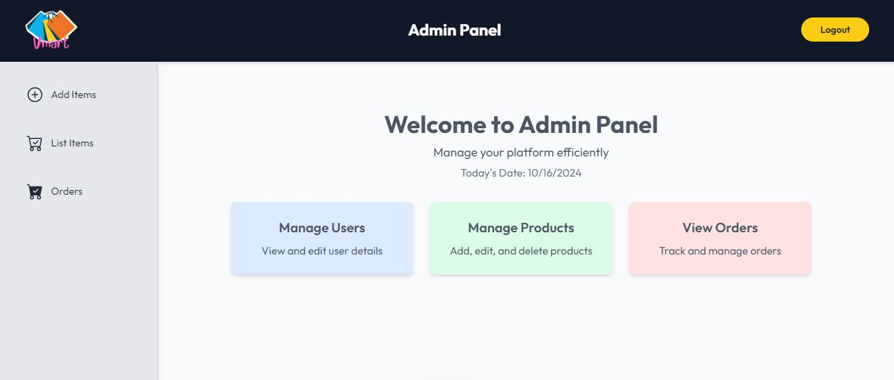

# Vmart - E-commerce Web Application

**Vmart** is a full-stack e-commerce application developed using the MERN stack. The platform provides a seamless shopping experience, allowing users to browse products, add items to the cart, and place orders. Additionally, the project includes an admin panel to manage orders and monitor users' activities. The application integrates payment methods such as Cash on Delivery (COD) and PayPal for a complete e-commerce solution.

## Table of Contents

1. [Features](#features)
2. [Technologies Used](#technologies-used)
3. [Installation](#installation)
4. [Usage](#usage)
5. [API Endpoints](#api-endpoints)
6. [Admin Panel](#admin-panel)
7. [Contributors](#contributors)
8. [Screenshots](#screenshots)


## Features

- User Authentication and Authorization using JWT.
- Product browsing with product details, search, and filtering functionality.
- Shopping Cart functionality with the ability to add, remove, and update items.
- Checkout process with options for Cash on Delivery and PayPal payment methods.
- Order history for users to track their purchases.
- Admin panel to manage products and update order statuses.
- Mobile-responsive design using Tailwind CSS.
  
## Technologies Used

- **Frontend:** React, Tailwind CSS, React Router DOM
- **Backend:** Node.js, Express.js, MongoDB (Mongoose ODM)
- **Database:** MongoDB
- **Authentication:** JWT (JSON Web Token)
- **Payments:** PayPal Integration, Cash on Delivery (COD)
- **Deployment:** Vercel (Frontend,backend & Admin)

## Installation

1. Clone the repository:

   ```bash
   git clone https://github.com/yourusername/vmart-ecommerce.git
   ```

2. Install dependencies for the backend:

   ```bash
   cd vmart-ecommerce/backend
   npm install
   ```

3. Install dependencies for the frontend:

   ```bash
   cd ../frontend
   npm install
   ```

4. Create a `.env` file in the backend directory and add the following variables:

   ```bash
   MONGO_URI=<your_mongodb_uri>
   JWT_SECRET=<your_jwt_secret>
   PAYPAL_CLIENT_ID=<your_paypal_client_id>
   ```

5. Run the application locally:

   - Start the backend server:
   
     ```bash
     cd backend
     npm run dev
     ```

   - Start the frontend server:
   
     ```bash
     cd frontend
     npm run dev
     ```

6. Access the application at `http://localhost:3000`.

## Usage

- **Browse Products:** Navigate through the collection of products, view details, and search/filter products.

- **Shopping Cart:** Add products to the cart, adjust quantities, and proceed to checkout.

- **Checkout:** Choose between Cash on Delivery (COD) and PayPal for payment methods. For PayPal payments, you can use the sandbox environment. When testing with sandbox, use demo credentials (email and password) provided for testing purposes. For card payment under PayPal, make sure to use credentials linked to U.S.-based accounts, as PayPal sandbox might not work for Indian cards.

- **Admin Panel:** Admin users can log in add/delete the products and manage orders, including updating order statuses.


## API Endpoints

Here are some key API endpoints:

- **User Routes:**
  - `POST /api/user/register`: Register a new user.
  - `POST /api/user/login`: User login.
  - `POST /api/user/admin`: Admin login.

- **Product Routes:**
  - `GET /api/product/list`: Get all products.
  - `POST /api/product/add`: Add products.
  - `DELETE /api/product/remove/:id`: Delete products.
  - `GET /api/product/single`: Single product details.

- **Cart Routes:**
  - `GET /api/cart/get`: Get all the cart item.
  - `POST /api/cart/add`: Add item to cart.
  - `DELETE /api/cart/update`: Update item in cart.

- **Order Routes:**
  - `POST /api/order/place-cod`: Place a new order using COD.
  - `POST /api/order/place-paypal`: Place a new order using Paypal.
  - `POST /api/order/user/userorders`: Get user order history.

- **Admin Routes:**
  - `POST /api/order/list`: Get all orders (Admin only).
  - `POST /api/order/status`: Update order status (Admin only).

## Admin Panel

The admin panel allows administrators to:

- Add & Delete the product.
- View all products.
- View all orders.
- Update the status of orders (e.g."Pending", "Shipped", "Delivered").

## Contributors

- **[Vinod Hadmode]**: Full-stack development,Frontend, Backend, admin panel, payment integration, and deployment.
  
## Screenshots

### Homepage


### All Product
  


### Product details page
  


### Cart page
  


### Login page
  


### Register page
  


### User Orders
  


### Admin Panel
  



